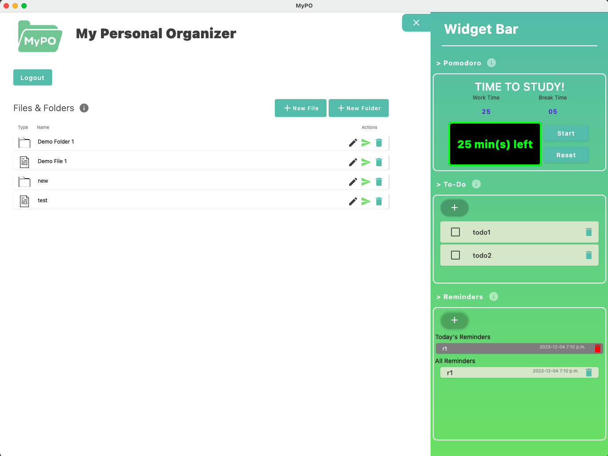

# MyPO (My Personal Organizer)
#### Team 212

---

### Project Goals
In order to aid university students with busy schedules, tight deadlines and messy notes, we designed MyPO, an all-in-one personal organizer.\
MyPO offers a variety of features such as Note Taker, Notes File System, Todo List, Reminders and Pomodoro timer. All of these features are designed to assist students.

### Team Members
Petar Vico, Derek Hung, Joshua Park, Aadar Gupta

### Screenshot

### Quick-Start Instructions

### Project Documents

Project Proposal (Requirements, Design): https://git.uwaterloo.ca/pvico/personal-organizer/-/wikis/Project-Proposal \
Meeting Minutes: https://docs.google.com/document/d/1H4kaf_hBVOf319-ZUvC8JTsa-LQdqnclfqmVkcM38p4/edit?usp=sharing \
Design: https://git.uwaterloo.ca/pvico/personal-organizer/-/wikis/Design \
Discussions: https://git.uwaterloo.ca/pvico/personal-organizer/-/wikis/Discussions \
Installation Instructions: https://git.uwaterloo.ca/pvico/personal-organizer/-/wikis/Installation-Instructions

---

### Software Releases

### Release 1.0
https://git.uwaterloo.ca/pvico/personal-organizer/-/wikis/Release-1

### Release 2.0
https://git.uwaterloo.ca/pvico/personal-organizer/-/wikis/Release-2

### Release 3.0
https://git.uwaterloo.ca/pvico/personal-organizer/-/wikis/Release-3

### Release 4.0
https://git.uwaterloo.ca/pvico/personal-organizer/-/wikis/Release-4

